###Dubbo背景和简介
Dubbo开始于电商系统，因此在这里先从电商系统的**演变**讲起。
1. 单一应用框架(ORM)
当网站流量很小时，只需一个应用，将所有功能如下单支付等都部署在一起，以减少部署节点和成本。
**缺点**：单一的系统架构，使得在开发过程中，占用的资源越来越多，而且随着流量的增加越来越难以维护
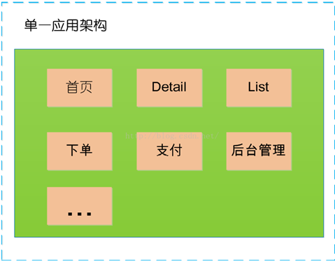
2. 垂直应用框架(MVC)
	垂直应用架构解决了单一应用架构所面临的扩容问题，流量能够分散到各个子系统当中，且系统的体积可控，一定程度上降低了开发人员之间协同以及维护的成本，提升了开发效率。
	**缺点**：但是在垂直架构中相同逻辑代码需要不断的复制，不能复用。
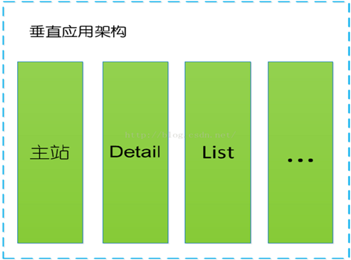

3. 分布式应用架构(RPC)
	当垂直应用越来越多，应用之间交互不可避免，将核心业务抽取出来，作为独立的服务，逐渐形成稳定的服务中心
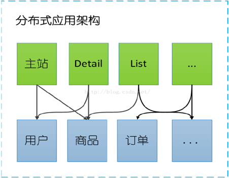

4.  流动计算架构(SOA)
随着服务化的进一步发展，服务越来越多，服务之间的调用和依赖关系也越来越复杂，诞生了面向服务的架构体系(SOA)，也因此衍生出了一系列相应的技术，如对服务提供、服务调用、连接处理、通信协议、序列化方式、服务发现、服务路由、日志输出等行为进行封装的服务框架

从以上是电商系统的演变可以看出架构演变的过程：
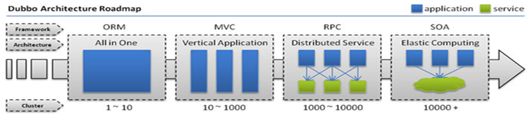
* 单一应用架构
	* 当网站流量很小时，只需一个应用，将所有功能都部署在一起，以减少部署节点和成本。
 * 此时，用于简化增删改查工作量的 数据访问框架(ORM) 是关键。
 
* 垂直应用架构
 * 当访问量逐渐增大，单一应用增加机器带来的加速度越来越小，将应用拆成互不相干的几个应用，以提升效率。
 * 此时，用于加速前端页面开发的 Web框架(MVC) 是关键。
* 分布式服务架构
	*  当垂直应用越来越多，应用之间交互不可避免，将核心业务抽取出来，作为独立的服务，逐渐形成稳定的服务中心，使前端应用能更快速的响应多变的市场需求。
	*  此时，用于提高业务复用及整合的 分布式服务框架(RPC) 是关键。
* 流动计算架构
	*  当服务越来越多，容量的评估，小服务资源的浪费等问题逐渐显现，此时需增加一个调度中心基于访问压力实时管理集群容量，提高集群利用率。
	*  此时，用于提高机器利用率的 资源调度和治理中心(SOA) 是关键。

---
在这里插播一条关于RPC的简介：
**RPC(Remote Procedure Call Protocol)：远程过程调用**：
     两台服务器A、B，分别部署不同的应用a,b。当A服务器想要调用B服务器上应用b提供的函数或方法的时候，由于不在一个内存空间，不能直接调用，需要通过网络来表达调用的语义传达调用的数据。
     说白了，就是你在你的机器上写了一个程序，我这边是无法直接调用的，这个时候就出现了一个远程服务调用的概念。
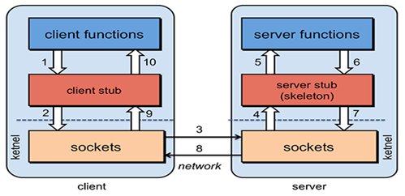
>RPC是一种通过网络从远程计算机程序上请求服务，而不需要了解底层网络技术的协议。RPC协议假定某些传输协议的存在，如TCP或UDP，为通信程序之间携带信息数据。在OSI网络通信模型中，RPC跨越了传输层和应用层。RPC使得开发包括网络分布式多程序在内的应用程序更加容易。
RPC采用客户机/服务器模式。请求程序就是一个客户机，而服务提供程序就是一个服务器。首先，客户机调用进程发送一个有进程参数的调用信息到服务进程，然后等待应答信息。在服务器端，进程保持睡眠状态直到调用信息到达为止。当一个调用信息到达，服务器获得进程参数，计算结果，发送答复信息，然后等待下一个调用信息，最后，客户端调用进程接收答复信息，获得进程结果，然后调用执行继续进行。

RPC需要解决的问题：
(可以稍作了解，详情可查看别的博文)
* **通讯问题** :  主要是通过在客户端和服务器之间建立TCP连接，远程过程调用的所有交换的数据都在这个连接里传输。连接可以是按需连接，调用结束后就断掉，也可以是长连接，多个远程过程调用共享同一个连接。
* **寻址问题** ： A服务器上的应用怎么告诉底层的RPC框架，如何连接到B服务器（如主机或IP地址）以及特定的端口，方法的名称名称是什么，这样才能完成调用。比如基于Web服务协议栈的RPC，就要提供一个endpoint URI，或者是从UDDI服务上查找。如果是RMI调用的话，还需要一个RMI Registry来注册服务的地址。
* **序列化 与 反序列化** ： 当A服务器上的应用发起远程过程调用时，方法的参数需要通过底层的网络协议如TCP传递到B服务器，由于网络协议是基于二进制的，内存中的参数的值要序列化成二进制的形式，也就是序列化（Serialize）或编组（marshal），通过寻址和传输将序列化的二进制发送给B服务器。
同理，B服务器接收参数要将参数反序列化。B服务器应用调用自己的方法处理后返回的结果也要序列化给A服务器，A服务器接收也要经过反序列化的过程。

---
###Dubbo是什么
Dubbo：
* 一款分布式服务框架
* 高性能和透明化的RPC远程服务调用方案
*  SOA服务治理方案

每天为2千多个服务提供大于30亿次访问量支持，并被广泛应用于阿里巴巴集团的各成员站点以及别的公司的业务中。

###Dubbo架构
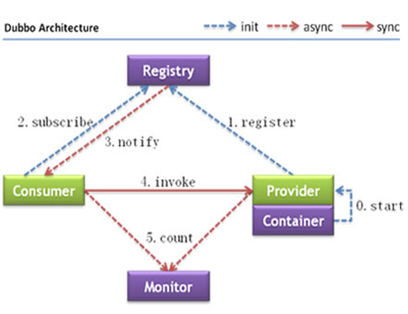

**Provider**: 暴露服务的服务提供方。
**Consumer**: 调用远程服务的服务消费方。
**Registry**: 服务注册与发现的注册中心。
**Monitor**: 统计服务的调用次数和调用时间的监控中心。

**调用流程**
0.服务容器负责启动，加载，运行服务提供者。
1.服务提供者在启动时，向注册中心注册自己提供的服务。
2.服务消费者在启动时，向注册中心订阅自己所需的服务。
3.注册中心返回服务提供者地址列表给消费者，如果有变更，注册中心将基于长连接推送变更数据给消费者。
4.服务消费者，从提供者地址列表中，基于软负载均衡算法，选一台提供者进行调用，如果调用失败，再选另一台调用。
5.服务消费者和提供者，在内存中累计调用次数和调用时间，定时每分钟发送一次统计数据到监控中心

###Dubbo注册中心
对于服务提供方，它需要发布服务，而且由于应用系统的复杂性，服务的数量、类型也不断膨胀；
对于服务消费方，它最关心如何获取到它所需要的服务，而面对复杂的应用系统，需要管理大量的服务调用。
而且，对于服务提供方和服务消费方来说，他们还有可能兼具这两种角色，即既需要提供服务，有需要消费服务。

通过将服务统一管理起来，可以有效地优化内部应用对服务发布/使用的流程和管理。服务注册中心可以通过特定协议来完成服务对外的统一。

**Dubbo提供的注册中心有如下几种类型可供选择**：
* Multicast注册中心
* Zookeeper注册中心
* Redis注册中心
* Simple注册中心


###Dubbo优缺点
**优点：**
1. 透明化的远程方法调用
     像调用本地方法一样调用远程方法；只需简单配置，没有任何API侵入。
2. 软负载均衡及容错机制
     可在内网替代nginx lvs等硬件负载均衡器。
3. 服务注册中心自动注册 & 配置管理
不需要写死服务提供者地址，注册中心基于接口名自动查询提供者ip。
使用类似zookeeper等分布式协调服务作为服务注册中心，可以将绝大部分项目配置移入zookeeper集群。
4. 服务接口监控与治理
Dubbo-admin与Dubbo-monitor提供了完善的服务接口管理与监控功能，针对不同应用的不同接口，可以进行 多版本，多协议，多注册中心管理。

**缺点：**
* 只支持JAVA语言


###Dubbo入门Demo
了解了Dubbo以后，自然要搭建一个简单的Demo实现。本文采用Dubbo与Zookeeper、Spring框架的整合。

主要是以下几个步骤：
1. 安装Zookeeper,启动；
2. 创建MAVEN项目，构建Dubbo+Zookeeper+Spring实现的简单Demo；
3. 安装Dubbo-admin，实现监控。 

##### 1  Zookeeper介绍与安装
本Demo中的Dubbo注册中心采用的是Zookeeper。为什么采用Zookeeper呢？

>Zookeeper是一个分布式的服务框架，是树型的目录服务的数据存储，能做到集群管理数据 ，这里能很好的作为Dubbo服务的注册中心。
>
Dubbo能与Zookeeper做到集群部署，当提供者出现断电等异常停机时，Zookeeper注册中心能自动删除提供者信息，当提供者重启时，能自动恢复注册数据，以及订阅请求

具体的安装方法在此不一一叙述，可参考博文：
http://blog.csdn.net/tlk20071/article/details/52028945

安装完成后，进入到bin目录，并且启动zkServer.cmd，这个脚本中会启动一个java进程：
(注：需要先启动zookeeper后，后续dubbo demo代码运行才能使用zookeeper注册中心的功能)
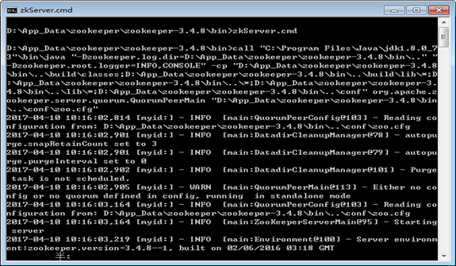


2 创建MAVEN项目
项目结构：
主要分三大模块：
dubbo-api : 存放公共接口；
dubbo-consumer :　调用远程服务；
dubbo-provider : 提供远程服务。
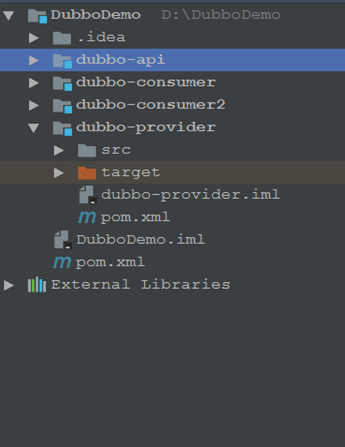

下面将详细叙述代码构建过程。
1) 首先构建MAVEN项目，导入所需要的jar包依赖。
需要导入的有spring, dubbo, zookeeper等jar包。
(详情参看后面提供的项目代码)


2)创建dubbo-api的MAVEN项目(有独立的pom.xml，用来打包供提供者消费者使用)。
在项目中定义服务接口：该接口需单独打包，在服务提供方和消费方共享。
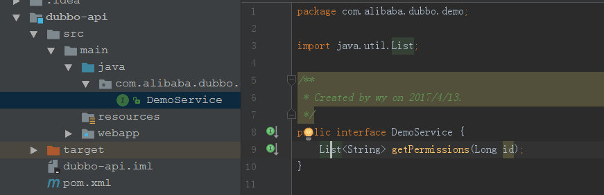

```
package com.alibaba.dubbo.demo;
import java.util.List;

public interface DemoService {
    List<String> getPermissions(Long id);
}
```

3)创建dubbo-provider的MAVEN项目(有独立的pom.xml，用来打包供消费者使用)。
实现公共接口，此实现对消费者隐藏：

```
package com.alibaba.dubbo.demo.impl;

import com.alibaba.dubbo.demo.DemoService;

import java.util.ArrayList;
import java.util.List;
public class DemoServiceImpl implements DemoService {
    public List<String> getPermissions(Long id) {
        List<String> demo = new ArrayList<String>();
        demo.add(String.format("Permission_%d", id - 1));
        demo.add(String.format("Permission_%d", id));
        demo.add(String.format("Permission_%d", id + 1));
        return demo;
    }
}
```

需加入公共接口所在的依赖
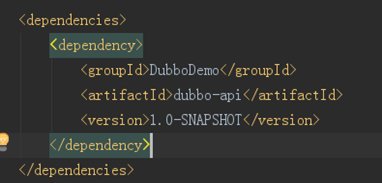

用Spring配置声明暴露服务

```
<?xml version="1.0" encoding="UTF-8"?>
<beans xmlns="http://www.springframework.org/schema/beans"
       xmlns:xsi="http://www.w3.org/2001/XMLSchema-instance"
       xmlns:dubbo="http://code.alibabatech.com/schema/dubbo"
       xsi:schemaLocation="http://www.springframework.org/schema/beans
       http://www.springframework.org/schema/beans/spring-beans.xsd
       http://code.alibabatech.com/schema/dubbo
       http://code.alibabatech.com/schema/dubbo/dubbo.xsd">
    <!--定义了提供方应用信息，用于计算依赖关系；在 dubbo-admin 或 dubbo-monitor 会显示这个名字，方便辨识-->
    <dubbo:application name="demotest-provider" owner="programmer" organization="dubbox"/>
    <!--使用 zookeeper 注册中心暴露服务，注意要先开启 zookeeper-->
    <dubbo:registry address="zookeeper://localhost:2181"/>
    <!-- 用dubbo协议在20880端口暴露服务 -->
    <dubbo:protocol name="dubbo" port="20880" />
    <!--使用 dubbo 协议实现定义好的 api.PermissionService 接口-->
    <dubbo:service interface="com.alibaba.dubbo.demo.DemoService" ref="demoService" protocol="dubbo" />
    <!--具体实现该接口的 bean-->
    <bean id="demoService" class="com.alibaba.dubbo.demo.impl.DemoServiceImpl"/>
</beans>
```

启动远程服务：
```
package com.alibaba.dubbo.demo.impl;

import org.springframework.context.support.ClassPathXmlApplicationContext;
import java.io.IOException;
public class Provider {
        public static void main(String[] args) throws IOException {
            ClassPathXmlApplicationContext context = new ClassPathXmlApplicationContext("provider.xml");
            System.out.println(context.getDisplayName() + ": here");
            context.start();
            System.out.println("服务已经启动...");
            System.in.read();
        }
    }
```
4)创建dubbo-consumer的MAVEN项目(可以有多个consumer，但是需要配置好)。 
调用所需要的远程服务：

通过Spring配置引用远程服务：

```
<?xml version="1.0" encoding="UTF-8"?>
<beans xmlns="http://www.springframework.org/schema/beans"
       xmlns:xsi="http://www.w3.org/2001/XMLSchema-instance"
       xmlns:dubbo="http://code.alibabatech.com/schema/dubbo"
       xsi:schemaLocation="http://www.springframework.org/schema/beans http://www.springframework.org/schema/beans/spring-beans.xsd
       http://code.alibabatech.com/schema/dubbo http://code.alibabatech.com/schema/dubbo/dubbo.xsd">
    <dubbo:application name="demotest-consumer" owner="programmer" organization="dubbox"/>
    <!--向 zookeeper 订阅 provider 的地址，由 zookeeper 定时推送-->
    <dubbo:registry address="zookeeper://localhost:2181"/>
    <!--使用 dubbo 协议调用定义好的 api.PermissionService 接口-->
    <dubbo:reference id="permissionService" interface="com.alibaba.dubbo.demo.DemoService"/>
</beans>
```

启动Consumer,调用远程服务：
```
package com.alibaba.dubbo.consumer;
import com.alibaba.dubbo.demo.DemoService;
import org.springframework.context.support.ClassPathXmlApplicationContext;
public class Consumer {
    public static void main(String[] args) {
        //测试常规服务
        ClassPathXmlApplicationContext context =
                new ClassPathXmlApplicationContext("consumer.xml");
        context.start();
        System.out.println("consumer start");
        DemoService demoService = context.getBean(DemoService.class);
        System.out.println("consumer");
        System.out.println(demoService.getPermissions(1L));
    }
}
```
5）运行项目，先确保provider已被运行后再启动consumer模块：
运行提供者：

消费者成功调用提供者所提供的远程服务：
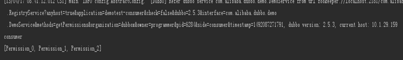

当然，这只是一个模拟的项目，实际中有多提供者多消费者情况，比这要复杂的多，当然只有这样才能体现dubbo的特性。

###Dubbo管理控制台介绍
管理控制台功能
>路由规则，动态配置，服务降级
  访问控制，权重调整
  负载均衡

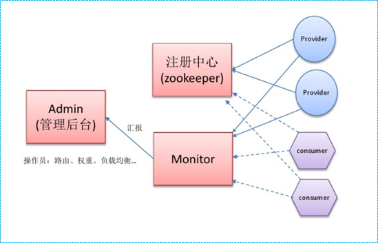

下载dubbo-admin，可自行根据网上介绍安装。大致做法就是将dubbo-admin中 的某个文件夹内容替换到tomcat的conf中，再运行tomcat即可。但我在实际操作中发现JDK8无法运行，后来找到一个JDK8可以实现的dubbo-admin版本，如有需要可留下邮箱索要。

成功开启输入用户名密码root后，即可进入控制台首页查看消费者提供者情况：
查看提供者：
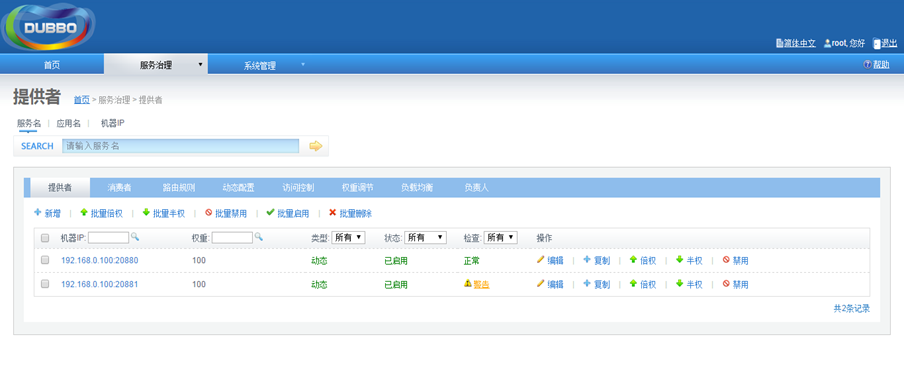
查看消费者：
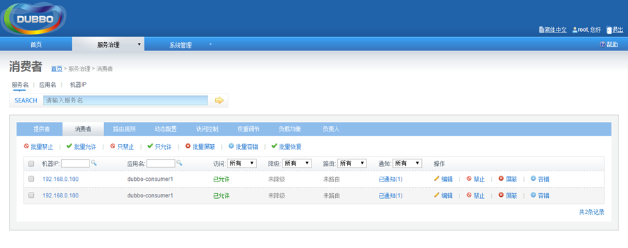

很遗憾，官方Dubbo网址早已不维护了，也出现了很多更新的Dubbo，比如当当网的Dubbox，可以自行了解。

整个项目的代码已经上传到我的github上，欢迎查看。


参考：https://www.zhihu.com/question/25536695
